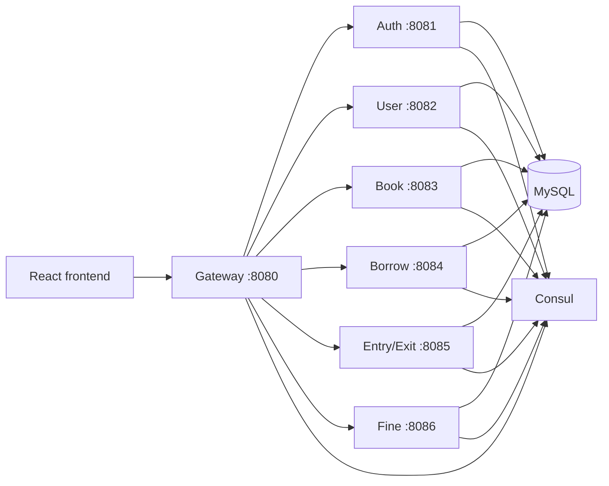
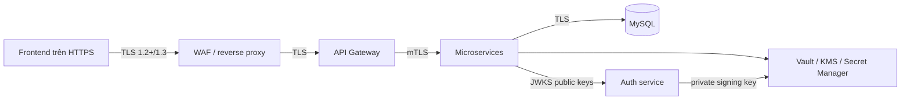

# University Digital Library

Hệ thống thư viện số theo kiến trúc microservice, gồm Gateway, xác thực, hồ sơ người dùng, sách, mượn/trả, ra/vào và xử phạt. Tài liệu này là checklist triển khai để đưa dự án từ môi trường phát triển sang một hệ thống **an toàn, ổn định và có thể vận hành**.

> Trạng thái: mã nguồn hiện có nền tảng nghiệp vụ và một phần Spring Security/AES-GCM/RSA. Chưa đạt mức an toàn để public Internet hoặc dùng dữ liệu thật.

## 1. Kiến trúc hiện tại



Các service giao tiếp qua Gateway/Consul/Feign. Hiện dự án dùng JWT cho đăng nhập và role; một số trường dữ liệu được mã hóa bằng AES-GCM ở tầng JPA.

## 2. Những phần đã có

| Hạng mục | Trạng thái | Ghi chú |
|---|---|---|
| Gateway và định tuyến service | Có | Có route và circuit breaker cơ bản. |
| Xác thực username/password | Có | Mật khẩu dùng BCrypt. |
| Phân quyền role | Có một phần | Controller có `@PreAuthorize`; cần kiểm thử toàn bộ luồng quyền. |
| JWT | Có, cần thay đổi | Đang là HS256 với một secret dùng chung giữa các service. |
| AES-256-GCM | Có một phần | IV ngẫu nhiên và GCM là lựa chọn đúng; key hiện chưa được quản lý an toàn/rotate. |
| Chữ ký RSA + SHA-256 | Có mã nguồn, chưa an toàn | Gateway verify chữ ký nhưng cơ chế hiện tại không đủ để chống giả mạo/replay. |
| Service discovery và circuit breaker | Có | Cần bổ sung quan sát, timeout và kiểm thử lỗi. |
| HTTPS/mTLS | Chưa hoàn thiện | TLS gateway hiện tắt trong cấu hình local; chưa có mTLS nội bộ. |
| Test bảo mật/crypto/integration | Chưa có | Các test hiện chủ yếu là smoke test khởi tạo context. |

## 3. Việc phải xử lý ngay

Không deploy public trước khi hoàn tất các mục này.

- [ ] Thu hồi và tạo lại mọi JWT secret, AES key, database password, keystore password và RSA key từng xuất hiện trong repository hoặc log.
- [ ] Xóa private RSA key khỏi frontend và lịch sử Git; coi key cũ là đã bị lộ vĩnh viễn.
- [ ] Không hard-code secret trong `application.yaml`, Java source, frontend bundle hoặc tài liệu.
- [ ] Tắt tài khoản mẫu/mật khẩu yếu ở môi trường production; không tự sinh `admin` mặc định.
- [ ] Chặn public registration tự chọn `ADMIN`/`LIBRARIAN`. Public registration chỉ tạo role được phép (ví dụ `STUDENT`); role nhạy cảm do quản trị viên cấp qua quy trình riêng.
- [ ] Không public trực tiếp các port service, MySQL và Consul; chỉ Gateway được mở ra Internet.
- [ ] Đặt `spring.jpa.hibernate.ddl-auto=validate` hoặc dùng Flyway/Liquibase ở production, không dùng `update`.
- [ ] Tắt SQL/debug logging và không ghi token, Authorization header, password hoặc dữ liệu cá nhân vào log.

## 4. Mục tiêu bảo mật



Mục tiêu là bảo vệ ba lớp:

1. **Khi truyền**: TLS bảo vệ dữ liệu khỏi nghe lén hoặc chỉnh sửa trên đường truyền.
2. **Khi lưu**: AES-256-GCM bảo vệ các trường nhạy cảm trong database; database backup cũng phải được mã hóa.
3. **Danh tính và quyền**: token ký bất đối xứng, phân quyền chặt chẽ, audit log và giới hạn tấn công đăng nhập.

## 5. Frontend kết nối backend mà không bị chặn/đọc trộm

### Điều cần hiểu đúng

HTTPS bảo vệ request trên đường truyền khỏi Wi-Fi công cộng, ISP, proxy trung gian và tấn công man-in-the-middle. Không thể che dữ liệu khỏi chính người dùng đang đăng nhập, extension độc hại trong trình duyệt, hoặc mã JavaScript đã bị XSS. Vì vậy phải dùng đồng thời TLS, bảo vệ token và chống XSS.

### Checklist frontend ↔ backend

- [ ] Dùng domain thật, ví dụ `https://app.example.edu` và `https://api.example.edu`; không gọi HTTP ở production.
- [ ] Gateway bắt buộc HTTPS, redirect HTTP sang HTTPS và bật HSTS sau khi chứng chỉ ổn định.
- [ ] Dùng certificate hợp lệ từ CA tin cậy (Let's Encrypt/Cloudflare hoặc CA của trường); tự động gia hạn và cảnh báo trước hạn.
- [ ] CORS chỉ cho phép chính xác domain frontend production/staging, method và header cần thiết; không dùng `*` cùng credentials.
- [ ] Access token ngắn hạn (khoảng 5–15 phút) và refresh token rotation.
- [ ] Ưu tiên refresh token trong cookie `HttpOnly; Secure; SameSite=Lax/Strict; Path=/auth/refresh`; JavaScript không được đọc refresh token.
- [ ] Nếu dùng cookie để xác thực request thay đổi dữ liệu, bổ sung CSRF token và kiểm tra `Origin`/`Referer` ở Gateway.
- [ ] Không để private key chung, JWT lâu hạn hay password trong `localStorage`, source code, Vite environment có tiền tố `VITE_`, hoặc log trình duyệt.
- [ ] Thiết lập CSP nghiêm ngặt, escape/validate dữ liệu hiển thị, không dùng `dangerouslySetInnerHTML` với dữ liệu không tin cậy; giảm nguy cơ XSS đánh cắp access token.
- [ ] Thêm headers: `Content-Security-Policy`, `X-Content-Type-Options: nosniff`, `Referrer-Policy`, `Permissions-Policy`, `Frame-Options`/`frame-ancestors`.
- [ ] Chỉ gửi thông tin cần thiết; password chỉ gửi tới endpoint login qua TLS và không được ghi vào log.

> Không cần và không được đóng gói private RSA key của hệ thống vào frontend để “ký mọi request”. Người tải trang đều có thể trích xuất key đó. TLS + session/token là lớp bảo vệ chính cho browser. Chữ ký client chỉ phù hợp nếu mỗi client có khóa riêng, khóa được bảo vệ thật sự và có cơ chế đăng ký/thu hồi khóa.

## 6. Xác thực và quản lý JWT

### Kiến trúc cần đạt

- Auth service ký JWT bằng **RS256 hoặc PS256** với private key chỉ nằm trong KMS/Vault/HSM.
- Mỗi service chỉ xác minh bằng public key qua JWKS; không cần biết private key hoặc shared HMAC secret.
- JWT bắt buộc kiểm tra `iss`, `aud`, `exp`, `nbf`, `sub`, `jti`, thuật toán cho phép và role/scope.
- JWT header có `kid` để tìm đúng public key trong JWKS.
- Token ngắn hạn; refresh token được lưu dạng hash trong database/Redis, rotation mỗi lần refresh, phát hiện reuse và có endpoint logout/revoke.

### Checklist

- [ ] Chuyển HS256 sang RS256/PS256 và khóa chặt algorithm allow-list.
- [ ] Thêm `issuer`, `audience`, `key-id (kid)`, `jti`, scopes/roles và kiểm tra chúng tại từng resource service.
- [ ] Tạo endpoint JWKS công khai chỉ chứa public keys; cache có TTL ở service.
- [ ] Lưu refresh token hash, device/session metadata, thời hạn và trạng thái revoked.
- [ ] Thêm logout tất cả thiết bị, revoke khi đổi password/role/bị khóa tài khoản.
- [ ] Rate-limit login/refresh, delay/backoff và lockout có kiểm soát để chống brute force.
- [ ] Ghi audit event cho login thất bại/thành công, thay đổi role, refresh reuse, revoke; tuyệt đối không ghi token thô.

## 7. Mã hóa AES-256-GCM và xoay vòng key

Không nên đổi AES key ngẫu nhiên ở mỗi request vì dữ liệu cũ sẽ không giải mã được. Cách đúng là version hóa khóa và dùng envelope encryption.

```text
Giá trị nhạy cảm
  └─ AES-256-GCM với DEK (data encryption key)
       ├─ iv ngẫu nhiên 96 bit
       ├─ AAD = service|table|recordId|column|schemaVersion
       └─ ciphertext + GCM tag

DEK được KMS/Vault bọc bởi KEK (key-encryption key)
Lưu: version, keyId, wrappedDEK, iv, ciphertext
```

### Checklist AES

- [ ] Đưa KEK vào Vault/KMS/HSM; ứng dụng nhận quyền đọc key tối thiểu qua identity riêng, không nhận plaintext key từ Git.
- [ ] Thêm định dạng ciphertext có `version` và `keyId`; hỗ trợ đọc key hiện tại lẫn key cũ.
- [ ] Kiểm tra độ dài AES key đúng 32 byte và validate input ciphertext/IV trước khi decrypt.
- [ ] Dùng AAD để ciphertext của cột/bản ghi này không thể bị copy sang cột/bản ghi khác.
- [ ] Xác định trường cần mã hóa: email, phone, address, định danh cá nhân, thông tin thanh toán/phạt và backup.
- [ ] Không mã hóa bừa các trường cần tìm kiếm; dùng blind index/HMAC tách biệt hoặc một search solution đã thiết kế cho encrypted data.
- [ ] Khi rotate: tạo `keyId` mới → đọc bằng key cũ → ghi lại bằng key mới theo batch → theo dõi tiến độ → chỉ hủy key cũ sau backup retention và migration hoàn tất.
- [ ] Tạo thủ tục rotate khẩn cấp khi nghi ngờ lộ key, có rollback và kiểm tra khôi phục backup.

## 8. RSA, SHA-256 và request signature

Mã ký hiện tại cần thay thế hoặc giới hạn phạm vi. Nó không được ký body/query và nonce chưa được lưu nên chưa chống replay hoàn toàn.

### Quy tắc dùng chữ ký

- Browser thông thường: dùng TLS + JWT/cookie. Không dùng một private key dùng chung trong bundle.
- Service-to-service hoặc đối tác ngoài: mỗi caller có cặp key riêng và `keyId` riêng; public key được đăng ký/thu hồi tại server.
- Dùng **RSA-PSS với SHA-256** (hoặc ECDSA P-256) cho thiết kế mới; private key ở KMS/HSM/service identity.
- Canonical request phải gồm: HTTP method, normalized path, normalized query, hash SHA-256 của body raw bytes, timestamp, nonce, `keyId` và version.
- Redis lưu khóa `callerId:nonce` với TTL ngắn; nonce trùng phải bị từ chối theo kiểu atomic `SET NX`.

### Checklist

- [ ] Bỏ private key khỏi frontend và rotate public/private pair hiện tại.
- [ ] Ký cả body hash và query, không chỉ path/timestamp/nonce.
- [ ] Dùng nonce Redis atomic, timestamp window nhỏ (ví dụ 60–120 giây), giới hạn kích thước request.
- [ ] Bind chữ ký với caller/client id và quyền cụ thể; một public key chung không đủ để xác định ai gọi.
- [ ] Không trả thông tin exception crypto chi tiết về client.
- [ ] Viết test: body thay đổi, query thay đổi, timestamp cũ, nonce lặp, sai `kid`, key đã revoke và thuật toán sai đều phải bị chặn.

## 9. Bảo mật microservice và database

- [ ] Gateway là entry point duy nhất; network policy/firewall không cho Internet đi thẳng vào port `8081–8086`, MySQL hay Consul.
- [ ] Bật mTLS cho Gateway ↔ services và service ↔ service; certificate riêng theo workload, tự rotate.
- [ ] Service-to-service không dựa vào endpoint `permitAll`; dùng service identity/scope riêng.
- [ ] Bật TLS MySQL, user DB riêng cho từng service theo least privilege; không dùng root.
- [ ] Tách database/schema theo service nếu có thể; migration do Flyway/Liquibase quản lý.
- [ ] Mã hóa backup, giới hạn truy cập backup và thường xuyên diễn tập restore.
- [ ] Bảo vệ Consul bằng ACL, TLS và không public UI/API ra Internet.
- [ ] Upload file: allow-list MIME + magic bytes, tên file do server sinh, lưu ngoài web root/private object storage, quét malware, giới hạn size/rate.

## 10. Độ ổn định và vận hành

- [ ] Chuẩn hóa Java/Spring Boot/Spring Cloud/JJWT version giữa các service và lock dependency versions.
- [ ] Thiết lập timeout kết nối/đọc/ghi, retry có backoff và jitter, circuit breaker, bulkhead; không retry request ghi nếu không có idempotency key.
- [ ] Dùng idempotency key cho đăng ký, mượn/trả, tạo phạt và thanh toán để tránh xử lý lặp.
- [ ] Transactional outbox hoặc message broker cho thay đổi xuyên service; không coi chuỗi Feign call là transaction phân tán.
- [ ] Health/readiness/liveness tách riêng; không công khai health detail nhạy cảm.
- [ ] Metrics, structured logs, tracing với correlation ID; cảnh báo error rate, latency, heap, DB connections, certificate/key expiry.
- [ ] Có backup/restore test, runbook sự cố, SLO và kế hoạch rollback deployment.
- [ ] Cấu hình production/staging/development tách profile; production fail-fast nếu thiếu secret/certificate.

## 11. Lộ trình thực hiện

### Giai đoạn 0 — Khẩn cấp: dừng lộ bí mật

- [ ] Rotate toàn bộ secret/key/password đã lộ.
- [ ] Bỏ private key frontend, account seed và hard-coded secret.
- [ ] Đưa secret vào Vault/KMS/secret manager; cập nhật `.gitignore`, secret scanning và pre-commit hook.
- [ ] Sửa public registration không được tự gán role đặc quyền.

**Hoàn thành khi:** secret scan không còn phát hiện secret thật; public registration không thể tạo admin; service production không khởi động nếu thiếu secret.

### Giai đoạn 1 — Kênh truyền và xác thực

- [ ] Deploy HTTPS ở Gateway, CORS allow-list, security headers và WAF/rate limit.
- [ ] Chuyển JWT sang RS256/PS256 + JWKS + `kid`.
- [ ] Access/refresh token rotation, logout/revocation và audit log.
- [ ] Tắt truy cập Internet trực tiếp tới internal services/database/Consul.

**Hoàn thành khi:** HTTP bị redirect/chặn, token sai issuer/audience/kid bị từ chối, internal port không truy cập được từ bên ngoài.

### Giai đoạn 2 — Dữ liệu và service trust

- [ ] Envelope encryption AES-GCM có version/keyId/AAD.
- [ ] Migration dữ liệu cũ, backup encryption, rotation runbook.
- [ ] mTLS và service identity; phân quyền internal API.
- [ ] Thay request signature chung bằng signed service-to-service requests (nếu thực sự cần).

**Hoàn thành khi:** key rotation không mất dữ liệu; ciphertext bị sửa/copy sang bản ghi khác không giải mã; service không có identity hợp lệ không gọi được internal API.

### Giai đoạn 3 — Chất lượng và vận hành

- [ ] Flyway/Liquibase, test authorization/crypto/integration, dependency/SAST/secret scan trong CI.
- [ ] Load test, chaos/failure test, observability, backup restore drill.
- [ ] Penetration test và khắc phục các finding trước public release.

**Hoàn thành khi:** CI pass các security gate; restore được backup đã mã hóa; có dashboard/alert/runbook và báo cáo pentest không còn lỗi Critical/High chưa chấp nhận rủi ro.

## 12. CI/CD security gates

- [ ] Build và unit test cho tất cả service.
- [ ] SAST (ví dụ Semgrep/SonarQube), dependency vulnerability scan và license scan.
- [ ] Secret scan cả lịch sử Git, pull request và artifact/container image.
- [ ] Test JWT claim/role/ownership và test access control cho từng endpoint.
- [ ] Test AES-GCM round-trip, IV uniqueness, tamper detection, key version migration.
- [ ] Dynamic API security test ở staging; rate-limit and upload test.
- [ ] Container scan, image ký số, SBOM và deploy bằng image digest cố định.

## 13. Definition of Done trước khi production

- [ ] Không còn secret/private key/password thật trong Git, artifact, frontend bundle hoặc log.
- [ ] Mọi traffic public là HTTPS; traffic nội bộ quan trọng là mTLS/TLS.
- [ ] JWT asymmetric/JWKS, token rotation/revoke, RBAC và ownership checks đã được test.
- [ ] Key management có `keyId`, rotation, backup và recovery test.
- [ ] CORS/CSP/cookie/CSRF được cấu hình theo domain production.
- [ ] Database least privilege, TLS, migration versioned và backup restore hoạt động.
- [ ] Internal services/Consul/DB không public Internet.
- [ ] Monitoring, alerting, audit logging, incident runbook và rollback đã có.
- [ ] Không có finding Critical/High từ dependency scan, SAST, secret scan và pentest mà chưa có xử lý/chấp nhận rủi ro chính thức.

## 14. Ghi chú cho môi trường local

Local có thể dùng HTTP, seed data và certificate tự ký để phát triển, nhưng các cài đặt này phải nằm trong profile `local` không thể vô tình deploy production. Không dùng key/credential production trong local hoặc tài liệu.

---

Tài liệu liên quan: [mô tả dự án](project_description.md) và [kế hoạch cũ](implementation_plan.md). Kế hoạch cũ cần được cập nhật theo nguyên tắc trong README này: private key không được đặt ở frontend và key rotation phải có version/KMS/Vault.
